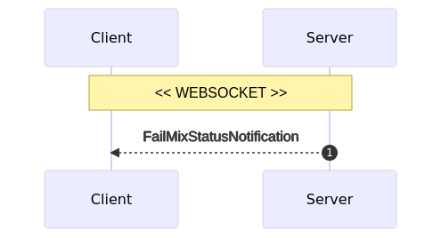

# Whirlpool architecture

## I. Usage
Whirlpool can be managed:
- from desktop: `whirlpool-gui`
- from command line: `whirlpool-cli`
- from REST API for developers: `whirlpool-cli API`
- from JAVA & Android: `whirlpool-client`

## II. Modules
Whirlpool is modular:
- 4 java modules: `server`, `client`, `protocol`, `cli`
- 1 electron/react module: `GUI`

`client` and `server` communicate through `protocol`.

## III. General
#### I. Coordinator
Coordinator urls are defined in [`WhirlpoolServer`](https://code.samourai.io/whirlpool/whirlpool-client/-/blob/develop/src/main/java/com/samourai/whirlpool/client/wallet/beans/WhirlpoolServer.java) (clearnet + Tor onion hidden services).
Coordinator is accessed through:
- REST over https: for pre-cycle and REGISTER_OUTPUT
- websocket: for cycle dialog

Dialog with coordinator is described in `whirlpool-protocol`

#### 2. REST
- All REST errors conform to [`RestErrorMessage`](https://code.samourai.io/whirlpool/whirlpool-protocol/-/blob/develop/src/main/java/com/samourai/whirlpool/protocol/rest/RestErrorResponse.java)
- REST client for Whirlpool is implemented in `whirlpool-client` with class [`ServerApi.java`](https://code.samourai.io/whirlpool/whirlpool-client/-/blob/develop/src/main/java/com/samourai/whirlpool/client/whirlpool/ServerApi.java)

#### 3. Websocket
Websocket uses:
- STOMP over websocket
- SockJS is supported (optional)
- Websocket client for Whirlpool is implemented in `whirlpool-client` with classes _`MixProcess.java`_, _`MixSession.java`_, _`MixClient.java`_

Each STOMP messages from client:
- requires StompHeader `protocolVersion`: defined in [`WhirlpoolProtocol`](https://code.samourai.io/whirlpool/whirlpool-protocol/-/blob/develop/src/main/java/com/samourai/whirlpool/protocol/WhirlpoolProtocol.java#L14), only bumps on breaking protocol changes.

Each STOMP message from coordinator:
- defines StompHeader `protocolVersion`: your client should check it to detect any beaking coordinator upgrade.
- defines StompHeader `messageType`: this is the payload type (Java class name).

Websocket errors are sent to client's queue `/private/reply` as [`ErrorResponse`](https://code.samourai.io/whirlpool/whirlpool-protocol/-/blob/develop/src/main/java/com/samourai/whirlpool/protocol/websocket/messages/ErrorResponse.java).

Client can open multiple websocket connexions to (re)mix in multiple pools simultaneously. We recommend a maximum of 1 PREMIX utxo per pool + 1 POSTMIX utxo per pool. Registering more inputs won't speed-up the mixing.

We suggest reconnecting after waiting for a mix for more than 1 hour.

#### 4. Messages
Each message field suffixed as "64" is encoded with Z85.

## IV. Pre-cycle
#### 1. Get pools

- Client submits `GET /rest/pools`
- Client receives [`PoolsResponse`](https://code.samourai.io/whirlpool/whirlpool-protocol/-/blob/develop/src/main/java/com/samourai/whirlpool/protocol/rest/PoolsResponse.java):
    - `pools[]`: array of [`PoolInfo`](https://code.samourai.io/whirlpool/whirlpool-protocol/-/blob/develop/src/main/java/com/samourai/whirlpool/protocol/rest/PoolInfo.java)
        - poolId: pool identifier
        - denomination: POSTMIX value
        - feeValue: Whirlpool fee
        - mustMixBalanceMin: PREMIX min value
        - mustMixBalanceCap: PREMIX max value
        - mustMixBalanceMax: deprecated
        - minAnonymitySet: pool anonymity set
        - minMustMix: min count of non-freeriders per mix
        - tx0MaxOutputs: max count of POSTMIX per Tx0
        - nbRegistered: currently registered users (including freeriders)
        - mixAnonymitySet: deprecated
        - mixStatus: current mix status
        - elapsedTime: current mix duration
        - nbConfirmed: currently confirmed users for next mix

#### 2. Create Tx0

- Client submits `POST /rest/tx0` [`Tx0DataRequestV2`](https://code.samourai.io/whirlpool/whirlpool-protocol/-/blob/develop/src/main/java/com/samourai/whirlpool/protocol/rest/Tx0DataRequestV2.java) to preview TX0:
    - `scode`: discount code (optional)
    - `partnerId`: partner identifier (`SAMOURAI`, `SPARROW`...)
- Client receives [`Tx0DataResponseV2`](https://code.samourai.io/whirlpool/whirlpool-protocol/-/blob/develop/src/main/java/com/samourai/whirlpool/protocol/rest/Tx0DataResponseV2.java):
    - `tx0Datas[]`: array of [`Tx0DataResponseV2.Tx0Data`](https://code.samourai.io/whirlpool/whirlpool-protocol/-/blob/develop/src/main/java/com/samourai/whirlpool/protocol/rest/Tx0DataResponseV2.java#L13)
        - `poolId`: pool identifier
        - `feePaymentCode`: payment code for `feePayload64` obfuscation
        - `feeValue`: Whirlpool fee
        - `feeChange`: fake fee value when `feeValue=0`
        - `feeDiscountPercent`: %discount applied
        - `message`: scode info
        - `feePayload64`: payload for OP_RETURN
        - `feeAddress`: fee destination
- Client creates the TX0
    - [1-N] deposit inputs (confirmed or not)
    - [1-N] PREMIX outputs (max count `PoolInfo.tx0MaxOutputs`) of the same value (`PoolInfo.mustMixBalanceMin <= value <= PoolInfo.mustMixBalanceCap`)
    - 1 Whirlpool fee output of `feeValue` to `feeAddress`, when `feeValue>0`
    - 1 fake Whirlpool fee output of `feeChange` to DEPOSIT, when `feeValue=0`
    - 1 OP_RETURN with `xorMask(feePayload64, input[0].key, feePaymentCode)`
    - eventual change output to DEPOSIT
- Client submits `POST /rest/tx0/push` [`Tx0PushRequest`](https://code.samourai.io/whirlpool/whirlpool-protocol/-/blob/develop/src/main/java/com/samourai/whirlpool/protocol/rest/Tx0PushRequest.java):
    - tx64: transaction to push
    - poolId: pool identifier
- On success: Client receives [`PushTxSuccessResponse`](https://code.samourai.io/whirlpool/whirlpool-protocol/-/blob/develop/src/main/java/com/samourai/whirlpool/protocol/rest/PushTxSuccessResponse.java) on success:
    - txid: transaction id successfully pushed
- On error: Client receives [`PushTxErrorResponse`](https://code.samourai.io/whirlpool/whirlpool-protocol/-/blob/develop/src/main/java/com/samourai/whirlpool/protocol/rest/PushTxErrorResponse.java) on error:
    - pushTxErrorCode: failure reason
    - voutsAddressReuse: (optional) output indexes with address-reuse

#### 3. CheckOutput

As stated in Cycle dialog, client should **NEVER** submit a `receiveAddress` already known by coordinator.  This means that client should keep a local POSTMIX index to increment on REGISTER_OUTPUT, and never be roll it back even in case of a mix failure.   
Reusing an already known `receiveAddress` will get the client blamed, then banned.  

To make sure a `receiveAddress` is unknown to the server, we suggest using the CheckOutput service at client startup.  
We also suggest to use it in case of REGISTER_OUTPUT failure.

- Client submits `POST /rest/checkOutput`
- Client receives HTTP 200 if output is unknown

## V. Cycle dialog

### A. Succesful mix process
This is the standard mix process.  
If the client gets disconnected for some reason, it has to restart the whole cycle dialog.

#### 1. REGISTER_INPUT

- Client connects to wss://${serverUrl}/ws/connect (no header required)
- Client subscribes to `/private/reply` (STOMP header: `poolId`)
- Client submits [`RegisterInputRequest`](https://code.samourai.io/whirlpool/whirlpool-protocol/-/blob/develop/src/main/java/com/samourai/whirlpool/protocol/websocket/messages/RegisterInputRequest.java):
    - `poolId`: obtained from /rest/pools
    - `utxoHash` + `utxoIndex`: a PREMIX or POSTMIX utxo (must have >= 1 confirmations)
    - `signature`: message "$poolId" signed with utxo's key
    - `liquidity`: true for PREMIX, false for POSTMIX
- Client is now automatically queued for mixing and keeps waiting for a [`ConfirmInputMixStatusNotification`](https://code.samourai.io/whirlpool/whirlpool-protocol/-/blob/develop/src/main/java/com/samourai/whirlpool/protocol/websocket/notifications/ConfirmInputMixStatusNotification.java). 
It takes generally a few minutes to be selected for the first mix (and a few hours for a free remix).
- If UTXO is banned, client will receive error {"message": "Banned from service. <optional details>"} to `/private/reply`

keeps waiting for a [`ConfirmInputMixStatusNotification`](https://code.samourai.io/whirlpool/whirlpool-protocol/-/blob/develop/src/main/java/com/samourai/whirlpool/protocol/websocket/notifications/ConfirmInputMixStatusNotification.java)

#### 2. CONFIRM_INPUT

- Client receives [`ConfirmInputMixStatusNotification`](https://code.samourai.io/whirlpool/whirlpool-protocol/-/blob/develop/src/main/java/com/samourai/whirlpool/protocol/websocket/notifications/ConfirmInputMixStatusNotification.java):
    - `mixId`: unique identifier of the mix round to join
    - `publicKey64`: public key to use for chaumian blinding

- Client generates a fresh POSTMIX `receiveAddress` (bech32) which was **NEVER used** yet, including in failed mixs. See checkOutput for this.
- Client generates a fresh `RSABlindingParameters` from `publicKey64`
- Client submits [`ConfirmInputRequest`](https://code.samourai.io/whirlpool/whirlpool-protocol/-/blob/develop/src/main/java/com/samourai/whirlpool/protocol/websocket/messages/ConfirmInputRequest.java):
    - `mixId`
    - `blindedBordereau64` = `chaumianBlind(receiveAddress, RSABlindingParameters)`
    - `userHash`: identifier which should be unique for {wallet, mixId}.  
We use this to prevent Client to mix with its own wallet when using multiple instances simultaneously (Android, CLI).  
It can be anything as long as it changes with mixId. We use: `sha256(mixId + sha256(premix00Bech32))`

- Client receives [`ConfirmInputResponse`](https://code.samourai.io/whirlpool/whirlpool-protocol/-/blob/develop/src/main/java/com/samourai/whirlpool/protocol/websocket/messages/ConfirmInputResponse.java) and it is now guaranteed to be in the mix:
    - `signedBordereau64`: chaumian signature of `blindedBordereau64` for the mix

#### 3. REGISTER_OUTPUT

- Client receives [`RegisterOutputMixStatusNotification`](https://code.samourai.io/whirlpool/whirlpool-protocol/-/blob/develop/src/main/java/com/samourai/whirlpool/protocol/websocket/notifications/RegisterOutputMixStatusNotification.java):
    - `inputsHash`: hash of all mixs inputs = `sha512(join(sort(inputHash+inputIndex)))` used as an anonymous verifiable mix round identifier.

- Client increments it's local POSTMIX counter to make sure that it won't ever submit again this `receiveAddress`, even if mix fails.

- Client submits [`RegisterOutputRequest`](https://code.samourai.io/whirlpool/whirlpool-protocol/-/blob/develop/src/main/java/com/samourai/whirlpool/protocol/rest/RegisterOutputRequest.java) through a different identity:
    - `inputsHash`
    - `unblindedSignedBordereau64` = `chamianUnblind(signedBordereau64, RSABlindingParameters)`
    - `receiveAddress`

- If `RegisterOutputRequest` fails, Client should run `CheckOutput` process (see below).

#### 4. SIGNING & SUCCESS

- Client receives [`SigningMixStatusNotification`](https://code.samourai.io/whirlpool/whirlpool-protocol/-/blob/develop/src/main/java/com/samourai/whirlpool/protocol/websocket/notifications/SigningMixStatusNotification.java):
    - `transaction64`: raw transaction to sign

- Client checks that `inputsHash` matches
- Client checks it's input among tx inputs
- Client checks it's output among tx outputs
- Client generates `witnesses64` by signing the transaction
- Client submits [`SigningRequest`](https://code.samourai.io/whirlpool/whirlpool-protocol/-/blob/develop/src/main/java/com/samourai/whirlpool/protocol/websocket/messages/SigningRequest.java):
    - `mixId`
    - `witnesses64`
- Client receives [`SuccessMixStatusNotification`](https://code.samourai.io/whirlpool/whirlpool-protocol/-/blob/develop/src/main/java/com/samourai/whirlpool/protocol/websocket/notifications/SuccessMixStatusNotification.java)
- Client disconnects

### B. Mix failure

#### 1. REVEAL_OUTPUT process
This process will trigger if a peer fails to REGISTER_OUTPUT, causing the mix to fail.  
Each client should reveal its registered output to coordinator, which will find and blame the faulty client.

- Client receives [`RevealOutputMixStatusNotification`](https://code.samourai.io/whirlpool/whirlpool-protocol/-/blob/develop/src/main/java/com/samourai/whirlpool/protocol/websocket/notifications/RevealOutputMixStatusNotification.java)
- Client submits [`RevealOutputRequest`](https://code.samourai.io/whirlpool/whirlpool-protocol/-/blob/develop/src/main/java/com/samourai/whirlpool/protocol/websocket/messages/RevealOutputRequest.java):
    - `mixId`
    - `receiveAddress`

#### 2. Mix failure

- Client receives [`FailMixStatusNotification`](https://code.samourai.io/whirlpool/whirlpool-protocol/-/blob/develop/src/main/java/com/samourai/whirlpool/protocol/websocket/notifications/FailMixStatusNotification.java)
- Client disconnects and restarts the whole cycle dialog.

#### 3. Ban policy
Client should avoid disconnecting after receiving `RegisterOutputMixStatusNotification`. If client disconnects during `REGISTER_OUTPUT` or `SIGNING`, it will ruin the mix and client may be temporarily banned after too many disconnects.
